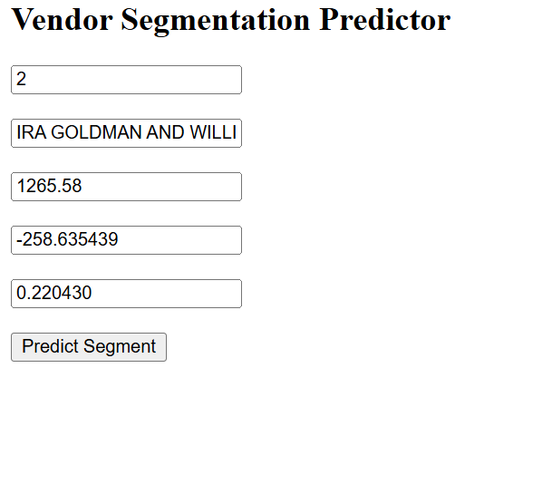
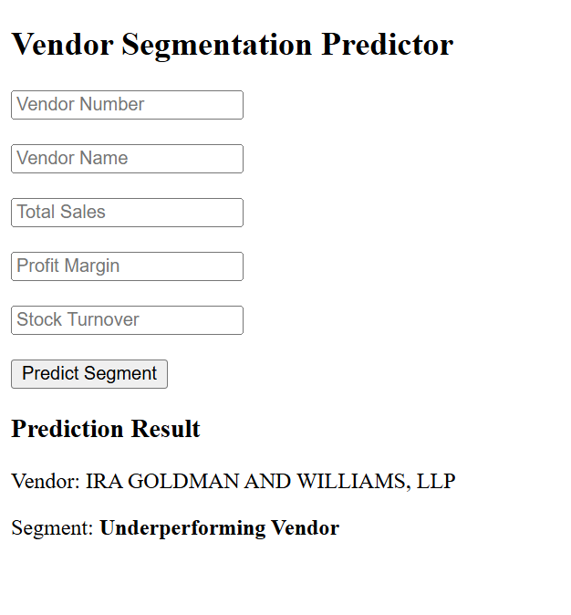

# Vendor Performance Analysis & Intelligent Vendor Segmentation

## Project Summary

Businesses often manage hundreds of vendors but struggle to identify which suppliers drive profitability, which vendors are efficient, and which relationships require intervention.

This project transforms raw inventory, purchase, sales, and vendor invoice data into actionable business intelligence through a complete analytics workflow involving:

- SQL Data Engineering
- Data Cleaning & Preparation
- Feature Engineering
- Statistical Analysis
- Exploratory Data Analysis (EDA)
- Machine Learning-Based Vendor Segmentation
- Interactive Power BI Dashboard
- Flask-Based Prediction Application

The final solution helps decision-makers identify strategic suppliers, growth opportunities, and underperforming vendors using both descriptive analytics and machine learning.

---

# Business Problem

Supplier management decisions are often made using isolated metrics such as sales or purchase volume.

However, vendor performance is multidimensional and depends on:

- Revenue generation
- Profitability
- Inventory efficiency
- Supplier contribution
- Stock movement

This project answers:

- Which vendors contribute most to company revenue?
- Which suppliers generate the highest profit margins?
- How efficiently is inventory moving?
- How much capital is tied up in unsold inventory?
- Are high-performing vendors statistically different from low-performing vendors?
- Can vendors be automatically segmented into meaningful business groups?

---

# Project Architecture

```text
MySQL Inventory Database
│
├── Purchases
├── Sales
├── Vendor Invoice
├── Beginning Inventory
└── Ending Inventory
         │
         ▼
SQL Aggregation & Data Engineering
         │
         ▼
vendor_sales_summary Dataset
         │
         ▼
Data Cleaning & Validation
         │
         ▼
Feature Engineering
         │
         ▼
Exploratory Data Analysis
         │
         ├── Sales Analysis
         ├── Profitability Analysis
         ├── Inventory Analysis
         ├── Statistical Testing
         └── Business Insights
         │
         ▼
Vendor-Level Analytical Dataset
         │
         ▼
Machine Learning Dataset
         │
         ▼
K-Means Clustering
         │
         ▼
Vendor Segmentation
         │
         ▼
Flask Prediction App
         │
         ▼
Power BI Dashboard
```

---

# Data Engineering & Dataset Creation

Instead of performing analysis directly on raw transactional tables, a consolidated analytical dataset called:

```sql
vendor_sales_summary
```

was created using SQL aggregation techniques.

The dataset combined information from:

- Purchases
- Sales
- Inventory
- Vendor Invoices

and produced vendor-level performance metrics.

### Dataset Size

- ~10,692 vendor-product records
- 126 unique vendors

This significantly reduced complexity while retaining business relevance.

---

# Data Cleaning & Preparation

Before analysis, the dataset underwent extensive preprocessing.

### Activities Performed

✔ Missing value handling  
✔ Data type corrections  
✔ Duplicate validation  
✔ Vendor standardization  
✔ Data quality checks  
✔ Outlier identification  
✔ Distribution analysis

Special attention was given to skewed financial variables and extreme vendor behaviors.

---

# Feature Engineering

Several business-focused metrics were created:

| Feature | Purpose |
|----------|----------|
| Gross Profit | Vendor profitability |
| Profit Margin | Profit efficiency |
| Stock Turnover | Inventory efficiency |
| Sales-to-Purchase Ratio | Sales effectiveness |
| Unsold Inventory Value | Capital locked in stock |
| Order Size Category | Purchasing behavior |

These features transformed raw operational data into meaningful business indicators.

---

# Exploratory Data Analysis (EDA)

A detailed EDA was performed to understand vendor behavior and business performance.

### Analysis Areas

- Sales Distribution
- Vendor Contribution
- Profitability Analysis
- Inventory Efficiency
- Unsold Inventory
- Correlation Analysis
- Statistical Testing
- Performance Benchmarking

---

# Major Business Insights

## 1. Supplier Concentration Risk

The top 10 vendors contributed approximately:

**65.69% of total purchases**

### Business Concern

Heavy dependence on a small group of suppliers increases operational risk.

### Recommendation

Diversify supplier relationships and reduce concentration exposure.

---

## 2. Unsold Inventory

Approximately:

**$2.71 Million**

was tied up in unsold inventory.

### Business Concern

Working capital remains locked in non-performing stock.

### Recommendation

Improve demand forecasting and inventory planning.

---

## 3. Profitability Analysis

Welch's Two-Sample T-Test revealed statistically significant differences between vendor groups.

### Result

- T-Statistic ≈ -17.64
- P-Value ≈ 0.000

### Interpretation

Vendor performance differences are not random and should be managed strategically.

---

## 4. Inventory Turnover & Profitability

Spearman Correlation:

```text
ρ = 0.782
```

### Interpretation

Higher inventory turnover strongly correlates with improved profitability.

### Recommendation

Focus on inventory efficiency initiatives and prioritize vendors with healthy turnover rates.

---

# Machine Learning: Vendor Segmentation

After completing business analysis, a dedicated machine learning dataset was created.

### Final Features

- LogSales
- ProfitMargin_Capped
- StockTurnover_Capped

### Why These Features?

They represent the three most important dimensions of vendor performance:

- Revenue Generation
- Profitability
- Inventory Efficiency

---

## Model Development

### Preprocessing

- Outlier Capping
- Log Transformation
- Standard Scaling

### Clustering Method

- K-Means Clustering

### Cluster Selection

Used:

- Elbow Method
- Silhouette Score

### Final Choice

```text
K = 3
```

Silhouette Score:

```text
0.6843
```

---

# Vendor Segments

| Segment | Vendors |
|----------|---------:|
| Strategic Vendors | 110 |
| High-Margin Growth Vendors | 9 |
| Underperforming Vendors | 7 |

## 🟢 Strategic Vendors

- Highest sales contribution
- Stable profitability
- Healthy inventory movement

### Business Action

Maintain strong supplier relationships and prioritize procurement.

## 🟡 High-Margin Growth Vendors

- Highest profit margins
- Highest inventory turnover
- Strong growth potential

### Business Action

Increase purchasing volume and strengthen partnerships.

## 🔴 Underperforming Vendors

- Low sales
- Negative profit margins
- Weak inventory turnover

### Business Action

Review contracts, optimize purchasing, or consider replacement.

---

# Vendor Segmentation Predictor

A Flask web application was developed to classify new vendors into business segments using the trained K-Means model.

### User Inputs

- Vendor Number
- Vendor Name
- Total Sales
- Profit Margin
- Stock Turnover

### Prediction Output

- Strategic Vendor
- High-Margin Growth Vendor
- Underperforming Vendor

---

# Power BI Dashboard

The Power BI dashboard provides:

### Executive Overview

- Total Vendors
- Total Sales
- Average Profit Margin
- Average Stock Turnover

### Segmentation Insights

- Vendor Distribution by Segment
- Segment Performance Comparison
- Sales Contribution Analysis

### Operational Insights

- Profitability Analysis
- Inventory Efficiency Analysis
- Vendor Drill-Down Reports

---

# Technology Stack

### Database & Querying

- MySQL
- SQL

### Data Analysis

- Python
- Pandas
- NumPy
- SciPy

### Visualization

- Matplotlib
- Seaborn
- Power BI

### Machine Learning

- Scikit-Learn
- K-Means Clustering
- StandardScaler
- Silhouette Analysis

### Deployment

- Flask
- Joblib

---

# Project Structure

```text
Vendor-Performance-Analysis/
│
├── data/
│   ├── vendor_sales_summary.csv
│   ├── vendor_level_dataset.csv
│   └── vendor_ml_dataset.csv
│
├── notebooks/
│   ├── vendor_analysis_cleaning_and_feature_engineering.ipynb
│   ├── vendor_performance_analysis.ipynb
│   └── vendor_segmentation_ml.ipynb
│
├── dashboard/
│   └── Vendor_Segmentation.pbix
│
├── app/
│   ├── app.py
│   ├── kmeans_vendor_model.pkl
│   ├── vendor_scaler.pkl
│   └── templates/
│       └── index.html
│
├── images/
│   ├── dashboard.png
│   ├── predictor_input.png
│   ├── predictor_output.png
│   └── cluster_distribution.png
│
├── README.md
└── requirements.txt
```

---

## ▶Running the Vendor Segmentation Predictor

Follow the steps below to run the Flask application locally.

### 1. Clone the Repository

```bash
git clone https://github.com/your-username/Vendor-Performance-Analysis.git
cd Vendor-Performance-Analysis
```


### 2. Verify Project Files

Ensure the following files are present inside the `app` folder:

```text
app/
│
├── app.py
├── kmeans_vendor_model.pkl
├── vendor_scaler.pkl
└── templates/
    └── index.html
```

### 3. Start the Flask Application

Navigate to the app directory and run:

```bash
python app.py
```

### 4. Open the Application

Open your browser and visit:

```text
http://127.0.0.1:5000
```

### 5. Enter Vendor Details

Provide:

- Vendor Number
- Vendor Name
- Total Sales
- Profit Margin
- Stock Turnover

Click **Predict Segment**.

### Example Input

```text
Vendor Number: 1587
Vendor Name: VINEYARD BRANDS INC
Total Sales: 1842143.10
Profit Margin: 35.066781
Stock Turnover: 0.966077
```

### Example Output

```text
Vendor: VINEYARD BRANDS INC

Segment: Strategic Vendor
```

### Application Interface



### Prediction Result




# Project Outcome

This project demonstrates a complete analytics lifecycle from raw transactional data to business intelligence, machine learning, dashboarding, and deployment.

The final solution enables organizations to:

- Identify strategic suppliers
- Detect underperforming vendors
- Improve inventory efficiency
- Reduce supplier concentration risk
- Support procurement decisions using data
- Automatically classify new vendors using machine learning

---
